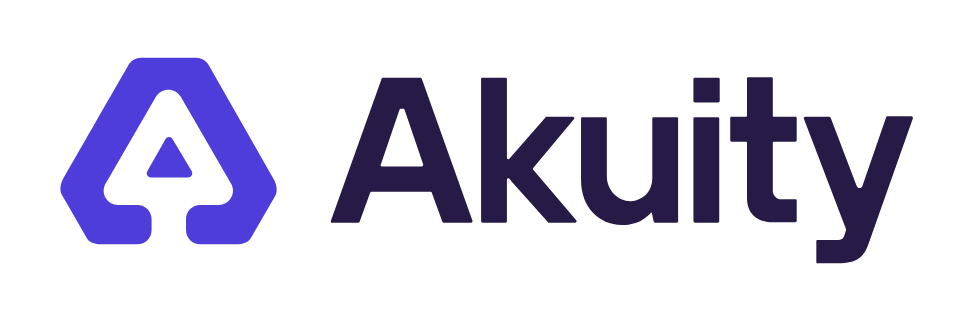

   

# Awesome Argo

🔔 NEWS:
* [Join us at ArgoCon NA 2024, colocated with KubeCon/CloudNativeCon 2024 Salt Lake City. Register now!](https://events.linuxfoundation.org/kubecon-cloudnativecon-north-america/co-located-events/argocon/)
* [Videos from ArgoCon Europe 2024](https://youtube.com/playlist?list=PLj6h78yzYM2NA4NbSC6_mQNza2r3WV87h&si=VzNsDD5n8gwnH36J) is available!
* The book [Distributed Machine Learning Patterns](https://bit.ly/2RKv8Zo) from Manning Publications (uses Argo Workflows) is officially published!
* ArgoCon North America 2023 [videos](https://github.com/akuity/awesome-argo#videos) are available!
* New releases:
  * [What’s new in Argo Workflows v3.5](https://blog.argoproj.io/whats-new-in-argo-workflows-v3-5-f260e8603ca6)
  * [Argo CD v2.11 Release Candidate](https://blog.argoproj.io/argo-cd-v2-11-release-candidate-b83ba3008ba5)
  * [Argo Rollouts 1.7 Release](https://blog.argoproj.io/argo-rollouts-1-7-release-candidate-8e391af94b7e?gi=5982149c2a2e)

Links to recordings for talks from various conferences, such as ArgoCon and KubeCon, are added as soon as they become available!

A curated list of awesome projects and resources related to [Argo](https://argoproj.github.io/), a [Cloud Native Computing Foundation (CNCF)](https://www.cncf.io/) graduated project.

This list is maintained and sponsored by [Akuity](https://akuity.io/), the Enterprise Company for Argo Project.

## What is Argo?

Argo consists of a set of open source tools for deploying and running applications and workloads on Kubernetes, including:
* [Argo Workflows](https://argoproj.github.io/workflows/): Kubernetes-native workflow engine supporting DAG and step-based workflows.
* [Argo CD](https://argoproj.github.io/cd/): Declarative continuous delivery with a fully-loaded UI.
* [Argo Rollouts](https://argoproj.github.io/rollouts/): Advanced Kubernetes deployment strategies such as Canary and Blue-Green made easy.
* [Argo Events](https://argoproj.github.io/events/): Event based dependency management for Kubernetes.

In addition, [argoproj-labs](https://github.com/argoproj-labs) is a separate GitHub org for community contributions related to the Argo ecosystem.

## Table of Contents

<!-- MarkdownTOC depth=4 -->

  - [Ecosystem Projects](#ecosystem-projects)
  - [Books](#books)
  - [Blog Posts](#blog-posts)
  - [Videos](#videos)
  - [Certifications](#certifications)
  - [Community](#community)
  - [Acknowledgement](#acknowledgement)

<!-- /MarkdownTOC -->

<a name="ecosystem-projects" />

## Ecosystem Projects

Selected projects from [argoproj](https://github.com/argoproj) (other than the four projects mentioned above) and [argoproj-labs](https://github.com/argoproj-labs):

* [Argo CD Autopilot](https://github.com/argoproj-labs/argocd-autopilot) offers an opinionated way of installing Argo CD and managing GitOps repositories.
* [Argo CD Extensions](https://github.com/argoproj-labs/argocd-extensions) enables extensions for Argo CD.
* [Argo CD Image Updater](https://github.com/argoproj-labs/argocd-image-updater) is a tool to automatically update the container images of Kubernetes workloads which are managed by Argo CD.
* [Argo CD Interlace](https://github.com/argoproj-labs/argocd-interlace) is a Kubernetes controller to enable software supply chain security capabilities in Argo CD.
* [Argo CD Operator](https://github.com/argoproj-labs/argocd-operator) is a Kubernetes operator for managing Argo CD clusters.
* [Argo CD Vault Plugin](https://github.com/argoproj-labs/argocd-vault-plugin) is an Argo CD plugin to retrieve secrets from Secret Management tools and inject them into Kubernetes resources.
* [Argo Helm](https://github.com/argoproj/argo-helm) is a collection of community-maintained Helm charts for Argo projects.
* [Argo Rollout Extension](https://github.com/argoproj-labs/rollout-extension) contains the Argo Rollout dashboard that can be added into the Argo CD Web UI.
* [Argo Rollouts Manager](https://github.com/argoproj-labs/argo-rollouts-manager) is a Kubernetes operator that provides an easy way to install, upgrade and manage the lifecycle of Argo Rollouts.
* [Argo Workflows Catalog](https://github.com/argoproj-labs/argo-workflows-catalog) contains free reusable templates for Argo Workflows.
* [Argo Workflows Plugins](https://argoproj.github.io/argo-workflows/plugin-directory) contains reusable plugins that extend Argo Workflows with new capabilities.
* [GitOps Engine](https://github.com/argoproj/gitops-engine) contains various GitOps operators that address different use-cases and provide different user experiences but all have a similar set of core features.
* [Hera](https://github.com/argoproj-labs/hera) is an Argo Python SDK. Hera aims to make construction and submission of various Argo Project resources easy and accessible to everyone.
* [Notifications Engine](https://github.com/argoproj/notifications-engine) is a configuration-driven Golang library that provides notifications for cloud-native applications.

Other open source projects that use Argo:

* [active-monitor](https://github.com/keikoproj/active-monitor) is a Kubernetes controller which enables deep cluster monitoring and self-healing using Argo Workflows.
* [applicationset-progressive-sync](https://github.com/Skyscanner/applicationset-progressive-sync) is a controller to allow a progressive sync of ArgoCD Applications generated by an ApplicationSet.
* [argo-cd-action](https://github.com/clowdhaus/argo-cd-action) is a GitHub Action for executing Argo CD.
* [argo-compare](https://github.com/shini4i/argo-compare) is a small CLI tool showing the difference in the resulting helm manifests rendered from Applications in different git branches.
* [argo-cd-mixin](https://github.com/adinhodovic/argo-cd-mixin) is a monitoring mixin for ArgoCD. A set of Grafana dashboards and Prometheus rules for ArgoCD.
* [argo-watcher](https://github.com/shini4i/argo-watcher) is a small service that improves the visibility of deployments that are using Argo CD Image Updater.
* [argocd-commenter](https://github.com/int128/argocd-commenter) is a Kubernetes controller to notify a change of Argo CD Application status via comments on GitHub pull requests and GitHub Deployments.
* [argocd-lovely-plugin](https://github.com/crumbhole/argocd-lovely-plugin) is a plugin that allows you to composite multiple things together into a single argocd application or applicationSet. Includes allowing Helm+Kustomize, addition other manifests trivially and running additional plugins in a pipe.
* [argocd-nutshell](https://github.com/jannfis/argocd-nutshell) is a set of scripts to set up repeatable, zero-conf demo and test environments for Argo CD using Vagrant, Ansible and VirtualBox
* [argocd-trivy-extension](https://github.com/mziyabo/argocd-trivy-extension) is Argo CD extension to enable visualization of Trivy generated vulnerability reports in Argo CD UI.
* [argopm](https://github.com/atlanhq/argopm) is a package manager for Argo Workflows. It enables developers to distribute and consume argo workflow templates as reusable modules.
* [backstage-plugin-argo-cd](https://www.npmjs.com/package/@roadiehq/backstage-plugin-argo-cd) is a Argo CD plugin for Backstage, an open platform for building developer portals.
* [Cello](https://github.com/cello-proj/cello) is a service for running infrastructure as code software tools including CDK, Terraform and Cloud Formation via GitOps.
* [ci-github-notifiter](https://github.com/sendible-labs/ci-github-notifier) is a lightweight container to post Argo Workflow statuses back to GitHub as [Status Checks](https://docs.github.com/en/pull-requests/collaborating-with-pull-requests/collaborating-on-repositories-with-code-quality-features/about-status-checks).
* [Couler](https://github.com/couler-proj/couler) provides a unified interface for constructing and managing workflows on different workflow engines.
* [deployKF](https://github.com/deployKF/deployKF) effortlessly integrates Kubeflow, and leading MLOps tools on Kubernetes into open ML platforms (uses Argo CD and Argo Workflows).
* [Devtron](https://github.com/devtron-labs/devtron) is a Web-Based CI/CD Platform for Kubernetes, powered by Argo.
* [Flowify](https://equinor.github.io/flowify-documentation/) Collaborative no code UI for Argo Workflows.
* [k8s-bootstrapper](https://github.com/hivenetes/k8s-bootstrapper) is a framework to set up production ready Kubernetes clusters using Terraform and Argo CD.
* [Kargo](https://github.com/akuity/kargo) helps GitOps practitioners streamline continuous delivery for Kubernetes by automating the progression of changes from one environment to the next.
* [Kedro](https://github.com/quantumblacklabs/kedro) is an open-source Python framework for creating reproducible, maintainable and modular data science code.
* [kubechecks](https://github.com/zapier/kubechecks) is a tool to check what changes a pull-request will make to your ArgoCD applications, with reporting directly in the PR.
* [kubefirst](https://github.com/kubefirst/kubefirst/) provides fully automated open source application delivery and infrastructure management GitOps platforms for Kubernetes.
* [Kubeflow Katib](https://github.com/kubeflow/katib) is a Kubernetes-native project for automated machine learning (AutoML).
* [Kubeflow Pipelines](https://github.com/kubeflow/pipelines) is dedicated to making deployments of machine learning workflows on Kubernetes simple, portable, and scalable with Kubeflow.
* [Metaflow](https://github.com/Netflix/metaflow) is a Python library for building and managing real-life data science projects.
* [Onepanel](https://github.com/onepanelio/onepanel) is the open source, end-to-end computer vision platform.
* [Orchest](https://github.com/orchest/orchest) is a tool for building data pipelines/workflows. It supports Jupyter notebooks and scripts in multiple languages and provides a user friendly UI/browser based editor.
* [Orkestra](https://github.com/Azure/orkestra) is a cloud-native release orchestration and lifecycle management (LCM) platform for the fine-grained orchestration of inter-dependent Helm charts and their dependencies.
* [Piper](https://github.com/quickube/piper) is a Kubernetes controller which enables managing multi-branch pipelines for Argo Workflows to shift left pipeline configuraiton.
* [Ploomber](https://github.com/ploomber/ploomber) helps overcome the challenges of working with Jupyter notebooks and allows teams to develop collaborative, production-ready pipelines using JupyterLab or any text editor.
* [provider-argocd](https://github.com/crossplane-contrib/provider-argocd) is the Crossplane infrastructure provider for Argo CD.
* [Reloader](https://github.com/stakater/Reloader) is a Kubernetes controller to watch changes in ConfigMap and Secrets and do rolling upgrades on associated Deployments/StatefulSets/Daemonsets and Argo Rollouts.
* [Seldon](https://github.com/SeldonIO/seldon-core) is an MLOps framework to package, deploy, monitor and manage thousands of production machine learning models.
* [SQLFlow](https://github.com/sql-machine-learning/sqlflow) extends SQL to support AI and compiles the SQL program to a workflow that runs on Kubernetes.
* [Tator](https://github.com/cvisionai/tator) is a web platform for analyzing large video and image datasets. Tator lets you rapidly deploy custom analytics workflows to gain insights from your raw imagery.
* [terraform-provider-argocd](https://github.com/oboukili/terraform-provider-argocd) is the Terraform provider for Argo CD.

<a name="books" />

## Books

* [Distributed Machine Learning Patterns](https://github.com/terrytangyuan/distributed-ml-patterns) teaches you how to take machine learning models from your personal laptop to large distributed clusters. You’ll explore key concepts and patterns behind successful distributed machine learning systems, and learn technologies like TensorFlow, Kubernetes, Kubeflow, and Argo Workflows with real-world scenarios and hands-on projects.
* [GitOps and Kubernetes](https://www.manning.com/books/gitops-and-kubernetes) teaches you how to use Git and the GitOps methodology to manage a Kubernetes cluster. The book interleaves theory with practice, presenting core Ops concepts alongside easy-to-implement techniques so you can put GitOps into action. Learn to develop pipelines that trace changes, roll back mistakes, and audit container deployment.

<a name="blogs" />

## Blog Posts

Please check out the [official Argo Project blog](https://blog.argoproj.io/). Additional links:

* [All About ArgoCD, a Beginner’s Guide](https://dev.to/abhinavd26/all-about-argocd-a-beginners-guide-33c9)
* [Applied GitOps with Argo CD](https://thenewstack.io/applied-gitops-with-argocd/)
* [Architecting Workflows For Reliability](https://blog.argoproj.io/architecting-workflows-for-reliability-d33bd720c6cc)
* [Argo 101 - What is Argo?](https://akuity.io/blog/argo-101-what-is-argo/)
* [Argo Ansible Role: Provisioning Argo Workflows on OpenShift](https://medium.com/@marekermk/provisioning-argo-on-openshift-with-ansible-and-kustomize-340a1fda8b50)
* [Argo CD: The GitOps Way](https://medium.com/@jon.mclean/argocd-the-gitops-way-90f7eb0d2606)
* [Argo CD and Crossplane for Managing the Whole Application Stack](https://blog.upbound.io/argo-crossplane-managing-application-stack/)
* [Argo CD Best Practices](https://codefresh.io/argo-platform/argo-cd-best-practices/)
* [Argo CD Build Environment Examples](https://akuity.io/blog/argo-cd-build-environment-examples/)
* [ArgoCD Best Practices You Should Know](https://datree.io/resources/argocd-best-practices-you-should-know)
* [ArgoCD Multi-cluster Deployments](https://deb4sh.github.io/2023/03/22/2023-02-09-DevOpsStories-ArgoCD-MultiCluster-Deployments/)
* [ArgoCon 2021 Akuity Team Recap](https://akuity.io/blog/argocon-2021-akuity-team-recap/)
* [Argo Integration Review](http://dev.matt.hillsdon.net/2018/03/24/argo-integration-review.html)
* [Argo Rollouts and Service Mesh: Automate and Control Canary Releases](https://blog.flomesh.io/argo-rollouts-and-service-mesh-automate-and-control-canary-releases-c71e5403eb2)
* [Argo Security Automation with OSS-Fuzz](https://medium.com/argo-project/argo-security-automation-with-oss-fuzz-da38c1f86452)
* [Argo Workflow As the Choice To Run Data Pipelines in Casavo](https://medium.com/casavo/argo-workflow-in-casavo-722b40362e4c)
* [Argo Workflow — Container Template](https://medium.com/@chukmunnlee/argo-workflow-container-template-db9fbaa115b3)
* [Argo Workflows Controller Scalability Testing on Amazon EKS](https://cnoe.io/blog/argo-workflow-scalability)
* [Automate Canary Analysis on Kubernetes with Argo](https://blog.px.dev/argo-rollouts/)
* [Building a Successful Open Source Community as an End User Company](https://medium.com/intuit-engineering/building-a-successful-open-source-community-as-an-end-user-company-89a70445134)
* [Best Practices for Multi-tenancy in Argo CD](https://blog.argoproj.io/best-practices-for-multi-tenancy-in-argo-cd-273e25a047b0)
* [CI/CD with Argo on Kubernetes](https://medium.com/@bouwe.ceunen/ci-cd-with-argo-on-kubernetes-28c1a99616a9)
* [Cloud Native CI/CD with Tekton and ArgoCD on AWS](https://aws.amazon.com/blogs/containers/cloud-native-ci-cd-with-tekton-and-argocd-on-aws/)
* [Continuous Delivery Using a Carvel ytt Argo CD Plugin](https://carvel.dev/blog/argocd-carvel-plugin/)
* [Decentralized GitOps Over Environments](https://blogs.sap.com/2021/05/06/decentralized-gitops-over-environments/)
* [Deploy Argo CD with Ingress and TLS in Three Steps: No YAML Yak Shaving Required](https://itnext.io/deploy-argo-cd-with-ingress-and-tls-in-three-steps-no-yaml-yak-shaving-required-bc536d401491)
* [Deploying Argo CD and Sealed Secrets with Helm](https://faun.pub/deploying-argo-cd-and-sealed-secrets-with-helm-8de12f53051b)
* [Designing A Complete CI/CD Pipeline CI/CD Pipeline Using Argo Events, Workflows, and CD](https://www.slideshare.net/JulianMazzitelli/designing-a-complete-ci-cd-pipeline-using-argo-events-workflow-and-cd-products-228452500)
* [DevOps in Argo CD — Disaster Recovery](https://medium.com/cloud-native-daily/devops-in-argo-cd-disaster-recovery-159bd0a4f285)
* [Enforcing Kubernetes Best Practices Using Kyverno and Argo CD](https://akuity.io/blog/argo-cd-kyverno-best-practice-policies)
* [Exploring Messaging Systems with Argo Events](https://dfarr.medium.com/exploring-messaging-systems-with-argo-events-a259f663bd30)
* [Extending GitOps: Effortless Continuous Integration and Deployment on Kubernetes](https://amplication.com/blog/extending-gitops-effortless-continuous-integration-and-deployment-on-kubernetes)
* [Four Lessons That Took Argo From First Commit to GitOps Darling](https://www.cncf.io/blog/2022/09/21/four-lessons-that-took-argo-from-first-commit-to-gitops-darling)
* [From Argo to Mentoring and Everything In Between](https://www.cncf.io/humans-of-cloud-native/yuan-tang-from-argo-to-mentoring-and-everything-in-between/)
* [Getting Started with ArgoCD for GitOps Kubernetes Deployments](https://medium.com/@outlier.developer/getting-started-with-argocd-for-gitops-kubernetes-deployments-fafc2ad2af0)
* [GitOps Deployment and Kubernetes - using Argo CD](https://medium.com/riskified-technology/gitops-deployment-and-kubernetes-f1ab289efa4b)
* [GitOps for Kubeflow using Argo CD](https://v0-6.kubeflow.org/docs/use-cases/gitops-for-kubeflow/)
* [GitOps - Getting Started with ArgoCD](https://vzilla.co.uk/vzilla-blog/gitops-getting-started-with-argocd)
* [GitOps – Including Backup in Your Continous Deployments](https://vzilla.co.uk/vzilla-blog/gitops-including-backup-in-your-continuous-deployments)
* [GitOps Model for Provisioning and Bootstrapping Amazon EKS Clusters Using Crossplane and Argo CD](https://aws.amazon.com/blogs/containers/gitops-model-for-provisioning-and-bootstrapping-amazon-eks-clusters-using-crossplane-and-argo-cd/)
* [GitOps Toolsets on Kubernetes with CircleCI and Argo CD](https://www.digitalocean.com/community/tutorials/webinar-series-gitops-tool-sets-on-kubernetes-with-circleci-and-argo-cd)
* [GitOps with Argo CD](https://www.giantswarm.io/blog/gitops-with-argocd-giant-swarm)
* [Gradual Code Releases Using an In-House Kubernetes Canary Controller on Top of Argo Rollouts](https://doordash.engineering/2021/04/14/gradual-code-releases-using-an-in-house-kubernetes-canary-controller/)
* [Hera - the Missing Argo Workflows Python SDK](https://www.dynotx.com/hera-the-missing-argo-workflows-python-sdk/)
* [How GitOps and Operators Mark the Rise of Infrastructure-As-Software](https://paytmlabs.com/blog/2021/10/how-to-improve-operational-work-with-operators-and-gitops/)
* [How Many Do You Need? - Argo CD Architectures Explained](https://akuity.io/blog/argo-cd-architectures-explained/)
* [How to Automate Verification of Deployments with Argo Rollouts and Elastic Observability](https://www.elastic.co/blog/automate-verification-of-deployments-with-argo-rollouts-and-elastic-observability)
* [How to Create a Theme for your Argo CD With Minimal CSS](https://akuity.io/blog/how-to-create-a-theme-for-your-argocd-with-minimal-css/)
* [How to Deploy With ArgoCD When Helm Values and Chart Are in Different Repositories](https://mixi-developers.mixi.co.jp/argocd-with-helm-fee954d1003c)
* [How to Manage Kubernetes Secrets with GitOps?](https://akuity.io/blog/how-to-manage-kubernetes-secrets-gitops/)
* [How to Update your OpenFaaS Functions Automatically with the Argo CD Image Updater](https://www.openfaas.com/blog/argocd-image-updater-for-functions/)
* [Human-Centric Data Science on Kubernetes with Metaflow](https://blog.argoproj.io/human-centric-data-science-on-kubernetes-with-metaflow-7f60aad34cba)
* [Humans of Cloud Native: Yuan Tang – From Argo to Mentoring and Everything In Between](https://www.cncf.io/humans-of-cloud-native/yuan-tang-from-argo-to-mentoring-and-everything-in-between/)
* [Introducing the AI Assistant for Argo CD inside Akuity Platform](https://akuity.io/blog/akuity-argo-ai-assistant/)
* [Jenkins X 3 and Argo CD](https://jenkins-x.io/blog/2021/06/28/argo/)
* [KubeCon EU 2022 - Akuity Team Recap](https://akuity.io/blog/kubeconeu-2022-akuity-team-recap)
* [Kubernetes Cluster Vending Machine With vcluster](https://blog.ediri.io/kubernetes-cluster-vending-machine-with-vcluster)
* [Kubernetes multi cluster et multi région en GitOps avec ArgoCD](https://www.mcorbin.fr/posts/2023-05-01-multi-cluster-argo/) (French)
* [Kubernetes Security through GitOps Best Practices: ArgoCD and Starboard](https://anaisurl.com/gitops-argocd-starboard/)
* [Machine Learning Hyperparameter Optimization with Argo](https://canvatechblog.com/machine-learning-hyperparameter-optimization-with-argo-a60d70b1fc8c)
* [Making Complex R Applications into Production using Argo Workflows](https://blog.argoproj.io/making-complex-r-application-into-production-using-argo-workflows-648ce5d190b5)
* [Manage Namespaces on Multitenant Clusters with ArgoCD, Kustomize and Helm](https://developers.redhat.com/articles/2022/04/13/manage-namespaces-multitenant-clusters-argo-cd-kustomize-and-helm)
* [Measuring Argo Workflow Costs with Kubecost](https://blog.kubecost.com/blog/measuring-argo-workflows-with-kubecost/)
* [Minimize Failed Deployments with Argo Rollouts and Smoke Tests](https://codefresh.io/continuous-deployment/minimize-failed-deployments-argo-rollouts-smoke-tests/)
* [Multi-cluster Management for Kubernetes with Cluster API and Argo CD](https://aws.amazon.com/blogs/containers/multi-cluster-management-for-kubernetes-with-cluster-api-and-argo-cd/)
* [Observations and Thoughts after Building 3 Kubernetes Platforms in Financial Services Industry](https://itnext.io/observations-and-thoughts-after-building-3-kubernetes-platforms-in-financial-services-industry-7d6c60206717)
* [Open Source Model Management Roundup: Polyaxon, Argo, and Seldon](https://www.anaconda.com/blog/developer-blog/open-source-model-management-roundup-polyaxon-argo-and-seldon/)
* [Producing 200 OpenStreetMap Extracts in 35 Minutes Using a Scalable Data Workflow](https://www.interline.io/blog/scaling-openstreetmap-data-workflows/)
* [Progressive Delivery with Argo Rollouts: Canary Deployment](https://www.infracloud.io/blogs/progressive-delivery-argo-rollouts-canary-deployment/)
* [Recover Automatically from Failed Deployments with Argo Rollouts and Prometheus Metrics](https://codefresh.io/continuous-deployment/recover-automatically-from-failed-deployments/)
* [Running Argo Workflows Across Multiple Kubernetes Clusters](https://admiralty.io/blog/running-argo-workflows-across-multiple-kubernetes-clusters/)
* [Scheduling Data Science Workflows in Azure with Argo and Metaflow](https://softlandia.fi/en/blog/scheduling-data-science-workflows-in-azure-with-argo-and-metaflow)
* [Sealed Secrets on Kubernetes with ArgoCD and Terraform](https://piotrminkowski.com/2022/12/14/sealed-secrets-on-kubernetes-with-argocd-and-terraform/)
* [Set up Microservices on Kubernetes — Automating Kubernetes with ArgoCD](https://medium.com/@hmquan08011996/setup-microservices-on-kubernetes-automating-kubernetes-with-argocd-cb94622dac5b)
* [Setting up Argo CD With Helm](https://www.arthurkoziel.com/setting-up-argocd-with-helm/)
* [Simplify and Automate Deployments Using GitOps with IBM Multicloud Manager 3.1.2](https://www.ibm.com/cloud/blog/simplify-and-automate-deployments-using-gitops-with-ibm-multicloud-manager-3-1-2)
* [Solving Configuration Drift Using GitOps with Argo CD](https://www.cncf.io/blog/2020/12/17/solving-configuration-drift-using-gitops-with-argo-cd/)
* [Stay Up to Date With Argo CD and Renovate](https://mjpitz.com/blog/2020/12/03/renovate-your-gitops/)
* Terraform Automation With Argo on Kubernetes ([Part1](https://medium.com/insideboard/terraform-automation-with-argo-on-kubernetes-part1-51b3914028d6) & [Part2](https://medium.com/insideboard/terraform-automation-with-argo-on-kubernetes-part2-consul-vault-92a020432cd0))
* [The Dynamic Duo of Kubernetes: Exploring Argo CD and Cluster API Integration](https://cloudnativesolutions.ro/blog/argocd-and-clusterapi/)
* [Unveil the Secret Ingredients of Continuous Delivery at Enterprise Scale with Argo CD](https://akuity.io/blog/unveil-the-secret-ingredients-of-continuous-delivery-at-enterprise-scale-with-argocd-kubecon-china-2021/)
* [Using Argo to Train Predictive Models](https://flightaware.engineering/using-argo-to-train-predictive-models/)
* [Using Argo CD with vclusters](https://medium.com/@helfand.4/using-argo-cd-with-vclusters-ff8b9c16ac9e)
* [Preventing Tag Mutation With kbld And Argo CD](https://blog.argoproj.io/preventing-tag-mutation-with-kbld-and-argo-cd-19cecd65963)
* [Argo Workflows Guide in Chinese](https://github.com/LinuxSuRen/argo-workflows-guide)
* [How To Create ArgoCD Applications Automatically Using ApplicationSet? “Automation of GitOps”](https://amralaayassen.medium.com/how-to-create-argocd-applications-automatically-using-applicationset-automation-of-the-gitops-59455eaf4f72)
* [Why we Created the Argo Project](https://akuity.io/blog/why-we-created-the-argo-project/)
* [Why We’re Switching Off Airflow — Sort Of](https://medium.com/flyr-labs-blog/why-were-switching-off-airflow-sort-of-780c4f58a660)
* [Picking A Kubernetes Orchestrator: Airflow, Argo, and Prefect](https://medium.com/arthur-engineering/picking-a-kubernetes-orchestrator-airflow-argo-and-prefect-83539ecc69b)
* [What Is ArgoCD? A Practical Tutorial With Kubernetes](https://spacelift.io/blog/argocd)

Blogposts that provide comparisons:
* Argo CD
  * vs. Flux: [[0]](https://akuity.io/blog/argo-cd-flux-comparison/), [[1]](https://www.sgmoratilla.com/2021-10-28-flux-vs-argocd/), [[2]](https://rajputvaibhav.medium.com/argo-cd-vs-flux-cd-right-gitops-tool-for-your-kubernetes-cluster-c71cff489d26), [[3]](https://thenewstack.io/gitops-on-kubernetes-deciding-between-argo-cd-and-flux/)
  * [vs. Spinnaker](https://tech.trell.co/choosing-a-continous-delivery-tool-spinnaker-vs-argocd-9adcc65a4fde)
  * [vs. Spinnaker, Jenkins X, and Tekton](https://www.inovex.de/blog/spinnaker-vs-argo-cd-vs-tekton-vs-jenkins-x/)
* Argo Workflows
  * [vs. Airflow and Prefect](https://medium.com/arthur-engineering/picking-a-kubernetes-orchestrator-airflow-argo-and-prefect-83539ecc69b)
  * vs. Airflow: [[0]](https://medium.com/flyr-labs-blog/why-were-switching-off-airflow-sort-of-780c4f58a660), [[1]](https://pipekit.io/blog/airflow-vs-argo-workflows), [[2]](https://hevodata.com/learn/argo-vs-airflow/)

<a name="videos" />

## Videos

Please check out the [official Argo Project YouTube channel](https://www.youtube.com/channel/UCOvYmppcbOPm1viN6ust3lA).

🔥 [ArgoCon Europe 2024](https://youtube.com/playlist?list=PLj6h78yzYM2NA4NbSC6_mQNza2r3WV87h&si=VzNsDD5n8gwnH36J)

KubeCon China 2024 talks:
* [Revolutionizing Scientific Simulations with Argo Workflows](https://www.youtube.com/watch?v=BYVf7GhfiRg)
* [Scaling Kubernetes: Best Practices for Managing Large-Scale Batch Jobs with Spark and Argo Workflow](https://www.youtube.com/watch?v=KqEKRPjy4aE)

ArgoCon and KubeCon North America 2023 talks:
* [Enforcing Supply Chain Security and Simplifying Compliance Audit for ArgoCD Deployments](https://youtu.be/MxeXmN5cY4U?si=Qoq1TS2sudLNWFoK)
* [Managing Argo CD Multi-Tenancy Effectively](https://youtu.be/HoVljPnJO1c?si=krut7ggiDxGZRkef)
* [Multi-Stage Deployment Pipelines the GitOps Way](https://youtu.be/_xsqKgWRsWI?si=HiEoD7lv7sA678q9)
* [DevOps in a GitOps World](https://youtu.be/hyA21gVaVsg?si=Oc5qRDfJT3hqaWJF)
* [Argo in an AI-Native World: Effective In-Cluster Machine Learning and Analytics at Scale](https://youtu.be/_nMmfW4Prl4?si=TpQxOr5f57DyfCft)
* [Expanding the Application Lifecycle for Everyone](https://youtu.be/XME4DELrhOc?si=U8YQ01c2iX0tp9N5)
* [Beyond Prototypes: Production-Ready ML Systems with Metaflow and Argo](https://youtu.be/mupRo7TX_H8?si=plxat7g2VLLDq6aD)
* [Major League Baseball + Argo CD: A Home Run](https://youtu.be/lLyzRvSM_6k?si=O_q13oh8VqARrlCv)
* [Migrating CI/CD from Jenkins to Argo](https://youtu.be/kKLIuAEc5Zw?si=7rIW0pF-CJCrAD2z)
* [Git Going Fast with Cilium and Argo](https://youtu.be/Ab9sctO-8Uk?si=1FOse8WJRu6_97iu)
* [How to Train an LLM with Argo Workflows and Hera](https://youtu.be/nRYf3GkKpss?si=xv13IQtoGe0-SZzA)
* [Towards Greener Deployment: Assessing Energy Efficiency in Argo CD and Traditional CD Pipelines](https://youtu.be/O-ApWOQ9pHM?si=7K48dpKhMIZGpyhF)
* [Orchestrating Rocket Simulations W/ Argo](https://youtu.be/ue1L420ORRk?si=CK4bD03htlIeTpnw)
* [Progressive Delivery with Argo Rollouts](https://youtu.be/QEeUUOze_4I?si=iSNdVUkWLR2p1K6G)
* [Driving the Platform at Deutsche Bahn with Crossplanes Provider-ArgoCD](https://youtu.be/IOYSIegd9UQ?si=L50lb_g9MbYM-Uuh)
* [Building a Bridge Between Argo CD and Terraform](https://youtu.be/ggJzfJgWO8c?si=dujPyNwc_KhetzMj)
* [Updating Databases the GitOps Way](https://youtu.be/U-o4HUNGHsE?si=_-IQeyFtCujpk0FH)
* [Lessons from Implementing Pull Request Generated Preview Apps at MasterClass](https://youtu.be/XG9DfOBdnxI?si=CPrami0sOng-NaMW)
* [The Journey from ClickOps to GitOps at Ford with Red Hat](https://youtu.be/zB-EWRVSQpY?si=_bVLWZ31jyV3a7oO)
* [Scaling Argo Events for Enterprise Scheduling: A Case Study from Intuit](https://youtu.be/ydpMkJMRuOU?si=dYUNXba6EQQ6II-b)
* [The Life of an Argo Workflows Salesperson](https://youtu.be/NasTMrLzaxk?si=um8Fi9FtLx1EQxQV)
* [Scaling to Thousands of Data & CI/CD Pipelines Using Argo and Virtual Clusters](https://youtu.be/wGik7O1qZbE?si=0ue-RaCXy3XScxoD)
* [Threat Model Report: Security Considerations for Hardening Declarative GitOps on K8s with Argo CD](https://youtu.be/_MISQWCVycc?si=U2Kl4ZgHY0YmmgxH)
* [Cross Cluster Execution of Argo Workflows](https://youtu.be/SPdxfr4SWO4?si=b9NL_oCRVVJM8A1S)
* [300 Hours of Repetitive Work in Just 3 Hours by Leveraging Argo Workflows and ArgoCD](https://youtu.be/De4rEB-Zcic?si=Rmm8GPMkK-LFR484)
* [Real Time Argo Rollouts Analytics Powered by Notification Engine](https://youtu.be/EbEWJP1HDt0?si=oaQg2LKzDBLVTFaV)
* [Tailored Deployment Strategies: Argo Rollouts for Diverse Applications](https://youtu.be/aWP6ZUdPXak?si=D7NW-80iGaxzdtFf)
* [Juggling Argo Rollouts for Progressive Delivery Across Multiple-Services](https://youtu.be/MjQTw4680oU?si=KLh8b4Z8ciGCMWHz)
* [Extending Argo Projects: Customizing Argo CD and Argo Rollouts for Your Needs](https://youtu.be/EZRyI2TEK3w?si=AYLHQ5eEtwrrWjnk)
* [Hitting the Runway with ArgoCD at American Airlines](https://youtu.be/FGP6z4bfrsg?si=rh1n61ACr2F1gHS3)
* [Click-Free Environment Promotion Driven by ApplicationSets Progressive Syncs](https://youtu.be/0PqzfNPp2VM?si=VAesEIicZZFyKlyZ)
* [Streamlining Big Data Workflows with Memoization & Work Avoidance](https://youtu.be/29r3wZHP2eU?si=FX0ri33whmYAAwd-)
* [Promotion Between Environments](https://youtu.be/lN-G9TV9Ty0?si=kbcANPQmF-mON9Cj)
* [The ArgoCD AppProject - What Is a Project and How to Power Your Multi-Tenant Security](https://youtu.be/x2WfwLSufCI?si=arJSmvJahRsU1pMS)
* [Comparing Argo Workflows and Apache Airflow at Scale](https://youtu.be/w98X_0LwKWw?si=gIn52k4EC1RWjieP)
* [Threat Model Report: Security Considerations for Hardening Declarative GitOps on K8s with Argo CD](https://youtu.be/gtJVmAu5g0M?si=EbUp6kUm3CdpKM4D)
* [Scaling Multi-cluster Management with Argo CD and Application Sets](https://youtu.be/Ns4MjCDKx7E?si=ueIgOf75slf-Y0jz)

ArgoCon Europe 2023 talks:
* [Argo and GitOps in a Managed Services World](https://youtu.be/yOLyj42cbko?list=PLj6h78yzYM2MqzIJyc5OBXAgFxjW6ZyBq)
* [ArgoCD as the Engine of a Brownfield Migration to Kubernetes](https://youtu.be/fIXF8A5JUkw?list=PLj6h78yzYM2MqzIJyc5OBXAgFxjW6ZyBq)
* [ArgoCon EU 2023 Welcome + Opening Remarks](https://youtu.be/B-lUcDAvEEw?list=PLj6h78yzYM2MqzIJyc5OBXAgFxjW6ZyBq)
* [Argo Project: The Cloud Native Key Ingredient](https://youtu.be/BFI3mya-dJk?list=PLj6h78yzYM2MqzIJyc5OBXAgFxjW6ZyBq)
* [Argo Rollouts from the Trenches – Next Level Progressive Delivery Best Practices](https://youtu.be/jRlEh2O7qdY?list=PLj6h78yzYM2MqzIJyc5OBXAgFxjW6ZyBq)
* [Argo Rollouts Reinvented: Unleash the Power of Custom Plugins for Progressive Delivery](https://youtu.be/O-i8y8f0mFg?list=PLj6h78yzYM2MqzIJyc5OBXAgFxjW6ZyBq)
* [Argo Workflows in Action: Rabobank's Journey to Cloud Native Banking](https://youtu.be/q7tRK9uPW0k?list=PLj6h78yzYM2MqzIJyc5OBXAgFxjW6ZyBq)
* [Cloud Native Deployments in Air Gapped Environments](https://youtu.be/W1c7Gm8_Fh8?list=PLj6h78yzYM2MqzIJyc5OBXAgFxjW6ZyBq)
* [Configuring Volumes for Parallel Workflow Reads and Writes](https://youtu.be/QZI-LXJGWYI?list=PLj6h78yzYM2MqzIJyc5OBXAgFxjW6ZyBq)
* [From Legacy to GitOps](https://youtu.be/UcxJ6tVf2dY?list=PLj6h78yzYM2MqzIJyc5OBXAgFxjW6ZyBq)
* [GitOps - The Magic Key to Cloud Native Security](https://youtu.be/nGcvPAQdpVg?list=PLj6h78yzYM2MqzIJyc5OBXAgFxjW6ZyBq)
* [GitOps and CI/CD: Maintaining Security in the Age of Automation](https://youtu.be/m7HtmGaDDjs?list=PLj6h78yzYM2MqzIJyc5OBXAgFxjW6ZyBq)
* [GitOps Me Some of That! Managing Hundreds of Clusters with Argo CD ](https://youtu.be/rh95h0uOEc8?list=PLj6h78yzYM2MqzIJyc5OBXAgFxjW6ZyBq)
* [How to Avoid a Kubernetes Doom Loop](https://youtu.be/skOTc_evJnw?list=PLj6h78yzYM2MqzIJyc5OBXAgFxjW6ZyBq)
* [How to Preview and Diff Your Argo CD Deployments](https://youtu.be/X392bJX0AEs?list=PLj6h78yzYM2MqzIJyc5OBXAgFxjW6ZyBq)
* [Improving Release Reliability with Argo Rollouts Across 10k Customer Services](https://youtu.be/LSg7GJ2KzcU?list=PLj6h78yzYM2MqzIJyc5OBXAgFxjW6ZyBq)
* [Leveraging Argo WorkflowTemplates Within a Data Platform](https://youtu.be/g8TCgnrM648?list=PLj6h78yzYM2MqzIJyc5OBXAgFxjW6ZyBq)
* [Managing Artifacts at Scale for CI and Data Processing](https://youtu.be/ucnOQuNkIbE?list=PLj6h78yzYM2MqzIJyc5OBXAgFxjW6ZyBq)
* [Merging Best Practices with Reality: One Repository for Code and Helm](https://youtu.be/yRkOAD6uLvE?list=PLj6h78yzYM2MqzIJyc5OBXAgFxjW6ZyBq)
* [Multi-Branch Pipeline with Argo Workflows and CI/CD Debugging](https://youtu.be/O_2CkIxE9Gc?list=PLj6h78yzYM2MqzIJyc5OBXAgFxjW6ZyBq)
* [NextGen Argo: Elevating Continuous Delivery with Easy to use PLugins](https://youtu.be/uYKjSlarlN4?list=PLj6h78yzYM2MqzIJyc5OBXAgFxjW6ZyBq)
* [Operate Sidecar and Sidecar-Less Applications with Istio and ArgoCD Rollouts](https://youtu.be/S0Ovalm8MF0?list=PLj6h78yzYM2MqzIJyc5OBXAgFxjW6ZyBq)
* [Revolutionizing Continuous Deployment: How Databricks Integrates Argo Rollouts to Achieve Zero-Downtime Releases](https://youtu.be/9NsVYqfehio?list=PLj6h78yzYM2MqzIJyc5OBXAgFxjW6ZyBq)
* [Sailing Across the Ocean of Argo Ecosystem Like a Pro](https://youtu.be/2Ld_oYU6-ow?list=PLj6h78yzYM2MqzIJyc5OBXAgFxjW6ZyBq)
* [Scaling Argo Security and Multi-Tenancy in AWS EKS at the New York Times](https://youtu.be/rro686bRIQU?list=PLj6h78yzYM2MqzIJyc5OBXAgFxjW6ZyBq)
* [Scaling Gene Therapy Research with Argo Workflows and Hera](https://youtu.be/h2TEw8kd1Ds?list=PLj6h78yzYM2MqzIJyc5OBXAgFxjW6ZyBq)
* [Scaling GitOps Using ArgoCD Application-Sets: Lesson Learnt](https://youtu.be/bj9qLpomlrs?list=PLj6h78yzYM2MqzIJyc5OBXAgFxjW6ZyBq)
* [Shipping Argo Workflows in Packages](https://youtu.be/UbnlQkIjn-4?list=PLj6h78yzYM2MqzIJyc5OBXAgFxjW6ZyBq)
* [Telefonistka - Safe and Controlled GitOps Promotion Across Environments](https://youtu.be/oiSsSiROj10?list=PLj6h78yzYM2MqzIJyc5OBXAgFxjW6ZyBq)
* [Training and Ensuring Reliability of ML Models at Wolt: The Power of ArgoCD, Flyte, and Argo Workflows](https://youtu.be/p3EaPotovBs?list=PLj6h78yzYM2MqzIJyc5OBXAgFxjW6ZyBq)
* [Using Kustomize KRM Functions to Enhance Argo CD Application Deployments](https://youtu.be/mVIo4qWggZU?list=PLj6h78yzYM2MqzIJyc5OBXAgFxjW6ZyBq)

Other talks:

* [A Briefer History of Argo Project from the Founding Engineers](https://youtu.be/FQ9uB8FuX_I)
* [A Distributed Job Scheduler Story: CronWorkflows integration with RBAC infrastructure for Over 100+ Teams](https://youtu.be/LXM3W4OiTpY)
* [Adobe’s Internal Developer Platform Journey and Lessons](https://youtu.be/NJF6bBU6Duw)
* [A Multi-Cluster, Multi-Cloud Infrastructure with GitOps at CERN](https://youtu.be/h6xDWc6fXao)
* [Applied GitOps with Argo CD Autopilot Using Multiple Clusters with an ApplicationSet](https://youtu.be/r3k2qI2NDsA)
* [Argo-Based Service Delivery for Multi-Tenant, Multi Region Clusters at Adobe](https://youtu.be/Ahps2IwhREw)
* [Argo: The Present, Past, and Future](https://youtu.be/76iUpAWakIM)
* [Argo and Tekton: Pushing the Boundaries of the Possible on Kubernetes](https://youtu.be/iPRw_n_JV4o)
* [Argo CD - GitOps Continuous Delivery for Kubernetes](https://www.youtube.com/watch?v=aWDIQMbp1cc&feature=youtu.be&t=1m4s)
* [Argo CD: Applying GitOps Principles To Manage Production Environment In Kubernetes](https://youtu.be/vpWQeoaiRM4)
* [Argo CD and Stateful Applications - Tips and Tricks](https://youtu.be/_-oVaO4SxLk)
* [Argo CD in the Cloud: DevOps and Docker Live Show](https://youtu.be/DxJawE0uZgw?t=366)
* [Argo CD Observability with AIOps - Detect Incident Fast](https://youtu.be/_pRJ0_yzxNs)
* [Argo CD Production Best Practices](https://youtu.be/ESQLqjbM8h0)
* [Argo CD Walkthrough – Learn Argo CD in 18 Minutes](https://youtu.be/2B3qcyCcBXs)
* [Argo Events - Event-Based Dependency Manager for Kubernetes](https://youtu.be/sUPkGChvD54)
* [Argo Events Deep-dive](https://youtu.be/U4tCYcCK20w)
* [Argo Graduation Q&A - Open Meeting with the Creators of Argo](https://youtu.be/kjB_7MaDzcw)
* [Argo Roadmap Updates For CD, Rollouts, Workflows, and Events](https://youtu.be/b07iZCR2ktQ)
* [Argo Rollouts - Canary Deployments Made Easy In Kubernetes](https://youtu.be/84Ky0aPbHvY)
* [Argo Rollouts at Scale: How We Brought Automated Rollback to 2100+ Micro-services at Monzo](https://youtu.be/Vl5siKnYymY)
* [Argo Workflows - 90m Hands-on Contributor Workshop](https://youtu.be/zZv0lNCDG9w)
* [Argo Workflows - Deep-dive into Components and Hands-on Experiments](https://docs.google.com/presentation/d/1IU0a3unnr3tBRi38Zn3EHQZj3z6yvocfG9x9icRu1LE/edit?usp=sharing)
* [Argo Workflows and Pipelines - CI/CD, Machine Learning, and Other Kubernetes Workflows](https://youtu.be/UMaivwrAyTA)
* [Argo’s Vibrant Ecosystem and Community](https://youtu.be/9tYkxlhXdw4)
* [Attacking Argo CD with Argo CD (and then Defending)](https://youtu.be/bRNMI29F2fI)
* [Automated Progressive Delivery Using GitOps and Service Mesh](https://youtu.be/5Ko-CnP2qhA)
* [Automating Map-building Pipelines for Safe Autonomous Driving with Argo Workflows at TuSimple](https://youtu.be/8aJGZEtMB6A)
* [Automating Research Workflows at BlackRock](https://www.youtube.com/watch?v=ZK510prml8o)
* [Automation of Everything - How To Combine Argo Events, Workflows & Pipelines, CD, and Rollouts](https://youtu.be/XNXJtxkUKeY)
* [Best Practices on Organizing GitOps Repositories](https://youtu.be/CvMevMHExHk)
* [Bridging into Python Ecosystem with Cloud-Native Distributed Machine Learning Pipelines](https://github.com/terrytangyuan/public-talks/tree/main/talks/bridging-into-python-ecosystem-with-cloud-native-distributed-machine-learning-pipelines-argocon-2021)
* [Building a Batch Processing Platform with Argo](https://www.youtube.com/watch?v=JQr16laspSs)
* [Building a Successful Open Source Community as an End-user Company](https://youtu.be/BrZMZJc3Vh4)
* [Building AutoML Pipelines With Argo Workflows and Katib](https://youtu.be/d8o7fEd8l2g)
* [Building Data Science Platform with Argo Workflows](https://www.youtube.com/watch?v=rLPuTL60T4c)
* [Building Medical Grade AI with Argo Workflows](https://youtu.be/4VPSktuM5Ow)
* [Challenging the Status Quo with Kubernetes and Argo](https://youtu.be/bRZmR1NrjFg)
* [CI/CD for Data Pipelines with Argo Workflows](https://youtu.be/729GwVMgeXw)
* [CI/CD for Machine Learning at MLB using Argo Workflows](https://youtu.be/fccWoYlwZKc?t=184)
* [CI/CD in Light Speed with K8s and Argo CD](https://www.youtube.com/watch?v=OdzH82VpMwI&feature=youtu.be)
* [Cloud-native CI/CD via ArgoCD & Workflows in Multi-region & Muti-cell Environment](https://youtu.be/IPiNWwPgsjw)
* [Cloud Native AutoML with Argo Workflows and Katib](https://youtu.be/KjHqmS4gIxM?t=181)
* [Cloud Native Live: Argo's Vibrant Ecosystem and Community + Maintainer Q&A](https://youtu.be/h6uecnyyGKw)
* [Combining Argo CD (GitOps), Crossplane (Control Plane), and KubeVela (OAM)](https://youtu.be/eEcgn_gU3SM)
* [Couchbase - How To Run a Database Cluster in Kubernetes Using Argo CD](https://youtu.be/nkPoPaVzExY)
* [Creating A Scalable Foundation for Kubernetes Multi-Tenancy](https://youtu.be/MSXZNMtcQP4)
* [Deploying Cluster Addons at Scale using ApplicationSets](https://youtu.be/Yj60Co4UxXk)
* [Deployments on the Edge using Argo CD & Workflows and K3s](https://youtu.be/9BSXBgaOmr4)
* [Distributed Load Testing Using Argo Workflows](https://youtu.be/9zg2EH2pRw0?t=1221)
* [Don’t Let a Bot In! Protect Fortune 500 Companies & Users](https://youtu.be/zZtnHkd3IS4)
* [Dynamic, Event-Driven Machine Learning Pipelines with Argo Workflows](https://youtu.be/ei4r0a7eAV0)
* [Easy Notifications for Kubernetes](https://youtu.be/gZ0MfSoHbY0)
* [Engineering Cloud Native AI Platform](https://github.com/terrytangyuan/public-talks/tree/main/talks/platform-con-2024-engineering-cloud-native-ai-platform)
* [Environments Based on Pull Requests (PRs): Using Argo CD To Apply GitOps Principles on Previews](https://youtu.be/cpAaI8p4R60)
* [Exploring HashiCorp Vault and ArgoCD - the GitOps Way](https://youtu.be/2camnnjyviw)
* [Extending GitOps to Manage K8s (so you don’t have to)!](https://youtu.be/bTHkDdXRx24)
* [From Code to Docs to Marketing: How to Contribute](https://youtu.be/kQZhdJn1Phw)
* [From PR to Artifactory in 60 Secs! Adobe Service Runtime Java Libraries Release Pipelines Using Argo Workflows](https://youtu.be/JD3dRElwXMM)
* [Getting Started with ArgoCD for GitOps Deployments](https://youtu.be/AvLuplh1skA)
* [GitOps Cloud Resource Management](https://youtu.be/TJQHB8XVW44)
* [GitOps for Kubernetes with ArgoCD, Crossplane, Kyverno and Paralus](https://www.youtube.com/live/JBG3B5WiYcA?feature=share)
* [GitOps Guide to the Galaxy: Argo Workflows](https://www.youtube.com/watch?v=2lI41q8Z7ko)
* [GitOpsify Everything: When Crossplane Meets Argo CD](https://youtu.be/9odjdVqJkws)
* [GitOps with Argo CD and an Argo Rollouts Canary Release](https://www.youtube.com/watch?v=35Qimb_AZ8U)
* [GitOps Without Pipelines With ArgoCD Image Updater](https://youtu.be/avPUQin9kzU)
* [Harder, Better, Faster, Stronger Pipelines at Adobe](https://youtu.be/AD3isYT6M1c)
* [How a Couple of Characters (and GitOps) Brought Down Our Site](https://youtu.be/FiEm2zOuHsg)
* [How Adobe Planned For Scale With Argo CD, Cluster API, And VCluster](https://youtu.be/p8BluR5WT5w)
* [How Intuit Does Canary and Blue Green Deployments](https://www.youtube.com/watch?v=yeVkTTO9nOA)
* [How Salesforce Is Moving From Spinnaker To Argo Workflows For Provisioning Add-Ons](https://youtu.be/THJFffu-iK0)
* [How Scalable is Argo-Rollouts: A Cloud Operator’s Perspective](https://youtu.be/rCEhxJ2NSTI)
* [How the Argo Project Transitioned From Security Aware To Security First](https://youtu.be/EilOEF4gs0c)
* [How to Apply GitOps to Everything - Combining Argo CD and Crossplane](https://youtu.be/yrj4lmScKHQ)
* [How To Build Production Grade DevOps Platform Using Argo](https://youtu.be/ohPKiGhhHoI)
* [How to Keep a Secret in GitOps, Without Keeping It in Git](https://youtu.be/PTdwW-wG2uA)
* [Human-Friendly, Production-Ready Data Science Stack With Argo Workflows & Metaflow](https://www.youtube.com/watch?v=bLg5oHIjOpI)
* [Hundreds of Clusters Sitting in a Tree with Argo CD](https://youtu.be/casLvZWlIDw)
* [Implementing Preview Environments with GitOps in Kubernetes](https://youtu.be/QNAiIJRIVWA)
* [Infra-like-apps - GitOpsifying Cloud Natively Managed Infrastructure with Crossplane and Argo CD](https://youtu.be/epoTCI4pqdE)
* [Integrating Backup into Your GitOps CI/CD Pipeline](https://youtu.be/2mjlmjJ4NjQ)
* [Introducing Couler: Unified Interface for Constructing and Managing Workflows](https://github.com/terrytangyuan/public-talks/tree/main/talks/introducing-couler-unified-interface-for-constructing-and-managing-workflows-argo-workflows-community-meeting)
* [Introduction to Argo CD: Kubernetes DevOps CI/CD](https://www.youtube.com/watch?v=2WSJF7d8dUg&feature=youtu.be)
* [Intro to GitOps, Argo projects and Continuous delivery with Kubernetes](https://youtu.be/Ygmf3oauToE)
* [Intuitive Progressive Delivery Across Microservices in a Dependency Graph Using Argo Rollouts](https://youtu.be/02y5q4Cc2Fs)
* [Journey of the Argonauts](https://youtu.be/boqZFQRLc9s)
* [K8s Cluster Vending Machine With vCluster](https://youtu.be/GkaqN8urStg)
* [Keynote: Welcome + Opening Remarks (Maintainers Fireside Chat)](https://youtu.be/DWFzChxXXrU?t=469)
* [Kubernetes Blue-Green Deployments with Argo Rollouts](https://www.youtube.com/watch?v=krDxDz4V4Tg)
* [Kubernetes Canary Deployments with Argo Rollouts](https://www.youtube.com/watch?v=fviYWA2mcF8)
* [Kubernetes Security through GitOps Best Practices: ArgoCD and Starboard](https://youtu.be/YvMY8to9aHI)
* [Large Scale Batch Processing with Argo Workflows and Events](https://youtu.be/J5XDDxcgP8E)
* [Leveling Up Your CD: Unlocking Progressive Delivery on Kubernetes](https://www.youtube.com/watch?v=Nv0PPwbIEkY)
* [Level Unlocked: GitOps to the Edge and Infrastructure Provisioning](https://youtu.be/4zDm23kA8oE)
* [Leveraging Argo Workflows and Argo Events for Cloud Agnostic Enterprise Machine Learning Deployments and Model Management](https://youtu.be/_Jbaecr_ZvI)
* [Like Peas And Carrots: Argo CD And Crossplane For Infrastructure Management](https://youtu.be/QO_-PG9snvI)
* [Litmus 2 - Chaos Engineering Meets Argo Workflows](https://youtu.be/B8DfYnDh2F4)
* [Machine Learning as Code: GitOps for ML with Kubeflow and ArgoCD](https://www.youtube.com/watch?v=VXrGp5er1ZE&t=0s&index=135&list=PLj6h78yzYM2PZf9eA7bhWnIh_mK1vyOfU)
* [Machine Learning with Argo and Ploomber](https://youtu.be/FnpXyg-5W_c?t=172)
* [Maintainer Update on Argo CD and Rollouts](https://youtu.be/wn6OOLoHvQg)
* [Maintainer Update on Argo Workflows and Events](https://youtu.be/FUekn40l9-A)
* [Making Complex R Forecast Applications Into Production Using Argo Workflows](https://www.youtube.com/watch?v=fPjztsUXHcg)
* [Manage More Clusters with Less Hassle, with Argo CD Application Sets](https://youtu.be/GcvHKc2IHi8)
* [Managing Thousands of Automatic Machine Learning Experiments with Argo and Katib](https://youtu.be/0jBNXZjQ01I)
* [Metaflow Integration with Argo Workflows](https://youtu.be/EagFq5QtcpI?t=859)
* [MLOps at Tripadvisor: ML Models CI/CD Automation with Argo](https://youtu.be/BochC4GKxbo?t=906)
* [Multi-Stage Delivery with Keptn and Argo Rollouts](https://www.youtube.com/watch?v=w-E8FzTbN3g&t=1s)
* [Multi-Tenancy For Argo Workflows And Argo CD At Adobe](https://youtu.be/aTgINAFV3T8)
* [Observability In ArgoCD/Rollouts Using Streaming ML For Reducing MTTR](https://youtu.be/-YGS1hmd60E)
* [Open Source Canary Deployments with Application Metric Analysis](https://youtu.be/OHU7dGcRZvg)
* [Preventing Tag Mutation With kbld And Argo CD](https://www.youtube.com/watch?v=KkgHYdVfXwY)
* [Preview Environments with ArgoCD](https://youtu.be/7ahiwZuiCBM)
* [Processing Petabytes in Python with Argo Workflows & Dask](https://youtu.be/f5lPS9WKy_8)
* [Production-Ready AI Platform on Kubernetes](https://github.com/terrytangyuan/public-talks/tree/main/talks/kubecon-europe-2024-production-ai-platform-on-k8s)
* [Robocat Meets Octopus and Octocat: Interoperability in CI/CD](https://youtu.be/Yq5lqr6n0E8)
* [Running Cloud-native Spark Jobs with Argo Workflows](https://youtu.be/X3xMtFs5XWo)
* [Scaling Argo for the Enterprise](https://youtu.be/kIcuMCargiE)
* [Scaling Kubernetes across BlackRock’s Aladdin Platform](https://youtu.be/Hoo9pngi5Q0)
* [Scaling Software Delivery on Argo](https://youtu.be/hS_y4SxiPME)
* [Secure by Default with GitOps - A Guide to OPA with Argo CD](https://youtu.be/EXu0rx0mtrM)
* [Securing GitOps Supply Chain with Sigstore and Kyverno](https://youtu.be/gBJ169_il6k)
* [Shh, It’s a Secret: Managing Your Secrets in a GitOps Way](https://youtu.be/7L6nSuKbC2c)
* [Smarter Progressive Delivery at Intuit](https://youtu.be/2P8_LWL3-MQ)
* [Supercharge Your Dev Experience [DX] with ArgoCD, Crossplane, & Shipa](https://youtu.be/-p0sn_X2CXQ)
* [TGI Kubernetes with Joe Beda: Argo Workflow System](https://www.youtube.com/watch?v=M_rxPPLG8pU&start=859)
* [TGI Kubernetes with Joe Beda: CloudEvents and Argo Events](https://www.youtube.com/watch?v=LQbBgQnUs_k&list=PL7bmigfV0EqQzxcNpmcdTJ9eFRPBe-iZa&index=2&t=0s)
* [The Argo Ecosystem: Tailoring Your Installation Through Community Add-ons](https://youtu.be/EPtiDNXpS78)
* [The Future of Continuous Delivery](https://youtu.be/dl1vqNpT_DE)
* [The Future of GitOps](https://youtu.be/r0yVUkTyWwI)
* [The Journey from DevOps to GitOps](https://youtu.be/2kokbYtslbw)
* [TikTok’s Story: How To Manage a Thousand Applications on Edge With Argo CD](https://youtu.be/Ftz5_lIepNA)
* [Towards Cloud-Native Distributed Machine Learning Pipelines at Scale](https://github.com/terrytangyuan/public-talks/tree/main/talks/towards-cloud-native-distributed-machine-learning-pipelines-at-scale-pydata-global-2021)
* [Tutorial: Everything You Need To Become A GitOps Ninja](https://www.youtube.com/watch?v=r50tRQjisxw)
* [Unleash ArgoCD Observability Superpowers](https://youtu.be/zNGg87RME7I)
* [Unveil The Secret Ingredients for Argo CD in the Enterprise-Scale](https://github.com/terrytangyuan/public-talks/tree/main/talks/unveil-the-secret-ingredients-for-argo-cd-at-enterprise-scale-kubecon-china-2021)
* [Using Argo CD & Datree for Stable Kubernetes CI/CD Deployments](https://youtu.be/17894DTru2Y)
* [Using Argo CD with vclusters](https://www.youtube.com/watch?v=M3ycfeocvNo)
* [Using Argo Project to Help Elastic infoSec Team in Securing Elastic](https://youtu.be/B8a3ySHvfF0)
* [Using Argo Workflows to Curate Chaos Engineering with LitmusChaos](https://youtu.be/fsGIbfd-O64)

<a name="certifications" />

## Certifications

* [Certified Argo Project Associate (CAPA) certification from CNCF](https://training.linuxfoundation.org/certification/certified-argo-project-associate-capa/)
* [Introduction to Continuous Delivery and GitOps using Argo CD](https://academy.akuity.io/courses/gitops-argocd-intro) by [Akuity](https://akuity.io/)

<a name="community" />

## Community

* [Argo Community Calendar](https://calendar.google.com/calendar/embed?src=argoproj@gmail.com) ([ICS File](https://calendar.google.com/calendar/ical/argoproj%40gmail.com/public/basic.ics))
* [Argo Project GitHub Organization](https://github.com/argoproj) ([Maintainers](https://github.com/argoproj/argoproj/blob/master/MAINTAINERS.md) and [Community Governance](https://github.com/argoproj/argoproj/blob/master/community/GOVERNANCE.md))
* [ArgoCon](https://events.linuxfoundation.org/argocon/)
* Argo Project User Survey Results:
  * 2023: [CD & Rollouts](https://blog.argoproj.io/cncf-argo-cd-rollouts-2023-user-survey-results-514aa21c21df), [Workflows & Events](https://blog.argoproj.io/argo-workflows-events-2023-user-survey-results-82c53bc30543)
  * [2022](https://blog.argoproj.io/cncf-argo-project-2022-user-survey-results-f9caf46df7fd)
  * [2021](https://github.com/argoproj/argoproj/blob/f4daa47706c73302faba1608cbc312bbafa0abfc/community/user_surveys/Argo%20CD%20and%20Rollouts%20User%20Survey%202021.pdf)
  * [2020](https://github.com/argoproj/argoproj/blob/f4daa47706c73302faba1608cbc312bbafa0abfc/community/user_surveys/ArgoWorkflows2020SurveySummary.pdf)
* [Peer Appreciation Program for Argo](https://akuity.io/argo-appreciation/) - The community can nominate individuals who they see as going above and beyond when it comes to contributing to and/or promoting the Argo Project.

Social media accounts:

* [LinkedIn](https://www.linkedin.com/company/argoproj/)
* [Slack](https://argoproj.github.io/community/join-slack)
* [Twitter](https://twitter.com/argoproj)
* [Reddit](https://www.reddit.com/r/argoproj/)

<a name="acknowledgement" />

## Acknowledgement

Some blogposts and videos are selected from [Argo's community blogs and presentations](https://github.com/argoproj/argoproj#community-blogs-and-presentations).

Thanks to the contributors who've submitted pull requests to add the original references to the following locations:
* [Argo Workflows](https://github.com/argoproj/argo-workflows/blob/master/README.md#community-blogs-and-presentations)
* [Argo CD](https://github.com/argoproj/argo-cd/blob/master/README.md#blogs-and-presentations)
* [Argo Events](https://github.com/argoproj/argo-events/blob/master/README.md#blogs-and-presentations)
* [Argo Rollouts](https://github.com/argoproj/argo-rollouts/blob/master/README.md#community-blogs-and-presentations)

**[⬆ back to top](#)**
